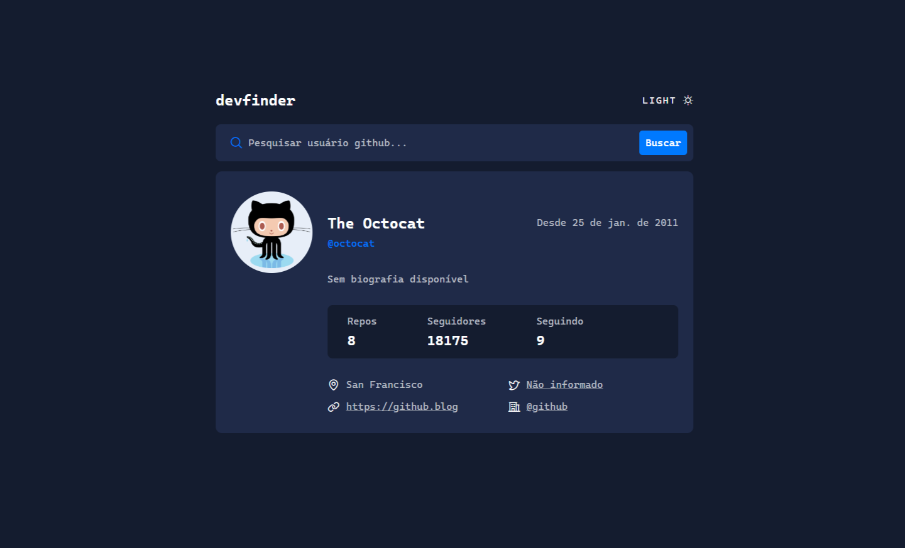

# Devfinder 
Aplicação para buscar perfis do GitHub em tempo real! Digite um nome de usuário e veja as informações mais importantes do perfil renderizadas com responsividade e tema claro/escuro.

---

## Projeto base
Este projeto foi inspirado em um desafio do site [Frontend Mentor](https://www.frontendmentor.io/), porém eu **não tive acesso ao design completo**, pois era um projeto pago.

Usei **apenas a imagem de amostra** como referência visual e recriei a interface e as funcionalidades por conta própria, adaptando conforme minha visão e aprendizados.

## 🚀 Funcionalidades
- Buscar perfis do GitHub via API pública.
- Exibir:
  - Foto de perfil, nome e @username.
  - Bio, empresa, localização, blog, Twitter, data de criação, número de repositórios, seguidores e seguindo.
- Feedback visual:
  - Mensagem de erro quando usuário não é encontrado.
  - Placeholder “Buscando...” durante a requisição.
  - Ocultação do card de perfil caso a busca falhe.
- Tema claro e escuro com salvamento no localStorage.
- Totalmente responsivo!

---

## 🛠️ Tecnologias utilizadas
- **HTML5**
- **CSS3** (com variáveis CSS e responsividade)
- **JavaScript (ES6+)**
- API do GitHub (`https://api.github.com/users/{username}`)

## 💡 O que aprendi
Durante o desenvolvimento, pratiquei e aprendi:

- Uso de `fetch()` com **async/await** para consumir a API do GitHub, tratando erros com `try/catch` e exibindo estados de loading/erro.
- Manipulação da DOM de forma dinâmica.
- Trabalhar com **fetch assíncrono** e `try/catch`.
- Controle de tema usando classes CSS e localStorage.
- Experiência de usuário (UX) com mensagens de feedback.
- Estilização responsiva para diferentes tamanhos de tela.

  ## Visualizar projeto
  [Ver projeto](https://devfinder-cyan.vercel.app/) | [Repositório](https://github.com/jamillyferreira/devfinder)

